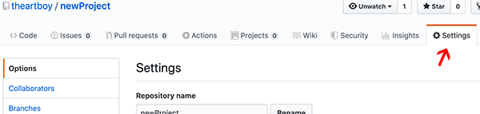
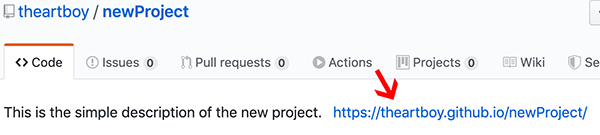
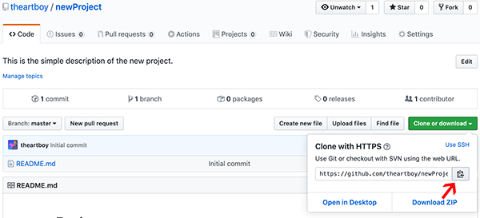
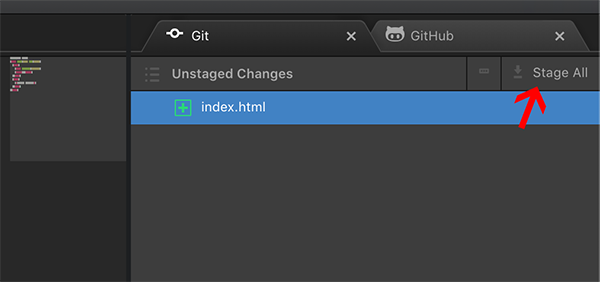
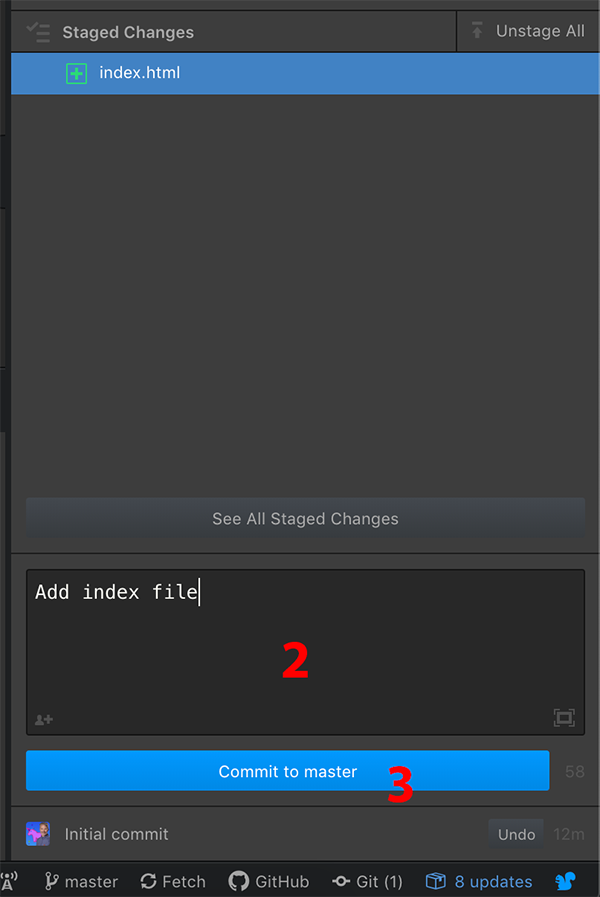

# newProject
Getting started with using GitHub requires for class will require:
* Setting up [Atom](https://www.atom.io)
* Creating the repository on [GitHub](https://github.com)
* Cloning the repository locally and adding the files and assets
* Pushing the local repo to the remote (online cloud version)

After the project is online, it can be cloned to any machine to continue working with the most current version.

### Command Line Tools
On the MacOS the default command line tool is Terminal. It is installed with the OS. The first time you try to use a git command it may ask for permission to install the command line tools needed for git. After that, it is good to go. There are many tutorials online for using Terminal and git.

On Windows the tool to use is PowerShell. Instructions for use and installation can be found on the [git](https://git-scm.com/book/en/v2/Appendix-A%3A-Git-in-Other-Environments-Git-in-PowerShell) documentation page.

Even easier \(in my opinion\) is to use a package add-on in Atom. This brings us to the setting up Atom part.

## Atom Setup
Open the **Atom-Preferences** usually found under the Atom pull-down menu. Then you will be in the Atom Settings document.

### Packages
Select **Install** and then in the **Install Package** field, type in the name of the package you want to install. If the package shows a lot of downloads, that most likely means it is useful and popular.

Then click the **Install** button.

The packages we will be using are:
* atom-beautify
* atom-live-server-plus
* color-picker
* minimap
* open-in-browser
* pigments
* platformio-ide-terminal

After installing the packages, restart Atom. Then they will be available under the packages menu in the correct alphabetical order.

### Themes
Click back on the install button on the left column. Where you searched packages, you will notice to the right is a greyed out button that says Themes. Click it and you can search for custom themes.

The theme I use is **monokai**. Click the **install** button to make it available.

Back in the left column menu click on Themes hutton. Now you need to set the UI Theme to **Atom Dark** and the Syntax Theme to **Monokai** to match the demonstrations in class.

## GitHub start
After logging on to your GitHub account, click the **plus** button on the top right and select **New Repository**.


Now you need to perform the following steps:
1. give the repository a name
2. type in a basic description of the project
3. click the box that says **initialize this repository with a README**
4. click the **Create repository** button


### Setting up Git-Pages
Click on the **Settings** tab. Scroll down to **GitHub Pages**.


Click on **Select Source** and choose **master branch**.


Scroll back down to **GitHub Pages** and copy the published URL \(right clicking is easiest\).


Scroll back to the top and click on the **Code** tab.
On the right side you will see the **edit** button. Click it and in the website field, paste the copied URL and then click the **save** button.


Now you have the URL to see your pages as a LIVE website


### Copy the repository URL
Click on the **Clone or download** button. Click on the clipboard icon to copy the repository URL.


## Atom start
Close all open windows in Atom.
Under the **Packages** pull-down menu select **platformio-ide-terminal** and click on **toggle**.


In the terminal window that opens at the bottom of the screen you will navigate to the Desktop with the following commands. Type in the command and hit the **return** key after each line.
```
cd ~
cd Desktop
```
Now you will clone the repository to the Desktop of your computer. Again in the terminal window. Type **git clone** and then paste the URL of your repository.
```
git clone https://github.com/yourUsername/yourRepo.git
```
Next you need to open the project folder using the terminal window. Type cd and the name of your repo.
```
cd yourRepoName
```
Now you should see the **Project** tab open on the left column. You are ready to start adding files to the project.

### Making a commit
Click the **git** button in the lower right of the Atom window. Alternatively, you can select the Packages pull-down menu, select **GitHub** and then **toggle git panel**.


1. In the top right corner, click the **Stage All** button.

2. Type a message in the **Commit** window
3. click the **Commit to master** button.

4. In the bottom right collection of buttons, click the **push** button and it will push your changes to the online repository.


Note: You may be asked to provide your GitHub username and password credentials.
